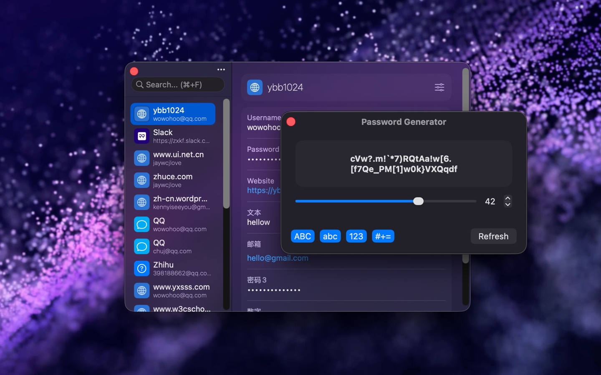

<!--idoc:ignore:start-->
> [!TIP]
> Declaration: This project is not an open-source project. The repository serves as the official website, used to collect issues and user demands. This is done to save costs, because without an official website, the application cannot pass the review.
<!--idoc:ignore:end-->

   
   
  
  <h1>
    Keyzer - Password Manager
  </h1>
  <!--rehype:style=border: 0;-->
  

    <a href="./README.zh.md">简体中文</a> • 
    <a target="_blank" href="https://github.com/jaywcjlove/keyzer/issues/new?template=bug_report.yml">Contact & Support</a> • 
    <a href="./CHANGELOG.md">Changelog</a>
  

  

    
  

Keyzer is a native password manager designed specifically for macOS, helping you securely store all your passwords and private information.
In daily life, you have sensitive data that you don't want others to know about, such as credit card information, bank accounts, and various passwords.
Keyzer encrypts and saves this data into a portable Keyzer file, ensuring your information is always stored locally on your device, fully offline, allowing you to protect your privacy while easily accessing and managing it.

## Privacy & Security

This is a very reasonable concern, and I fully understand why "trust" is so important in applications that handle sensitive information.

My design goal is to minimize the need for users to trust the developer personally:

- All data is stored only on your local device and is never uploaded to any server.
- There is no account system, no analytics, and no background networking.
- The app works completely offline, with data always under your control.

Additionally, this app is published through the Mac App Store, meaning it goes through Apple's review process and runs within Apple's sandbox and security mechanisms. This ensures to some extent that the app can only do what it claims to do and cannot access the system or other user data without permission.

Of course, I understand that everyone has different standards for security and trust, and if this app doesn't meet your expectations, that's completely understandable.