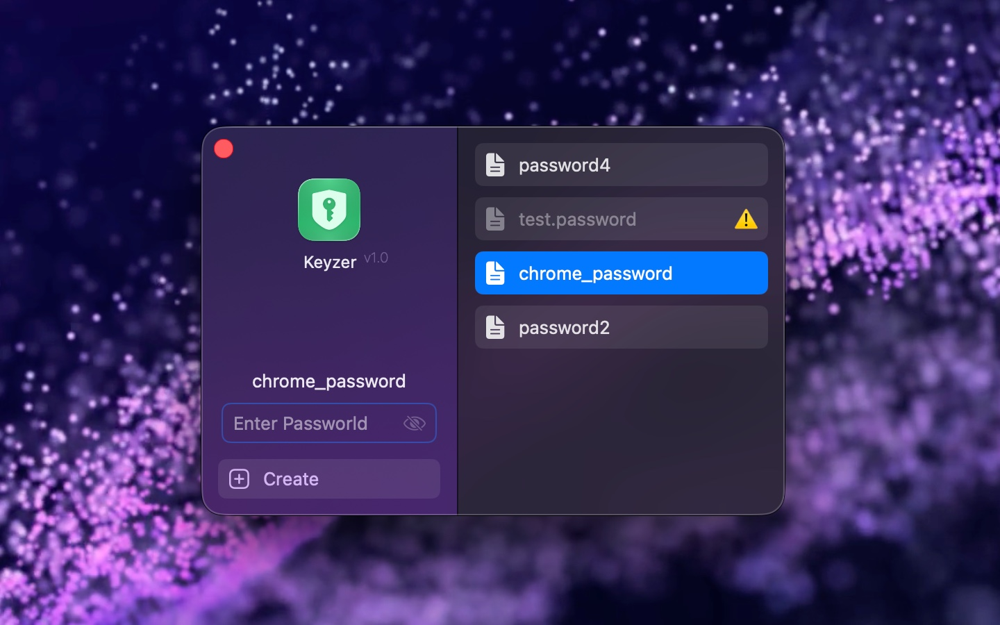
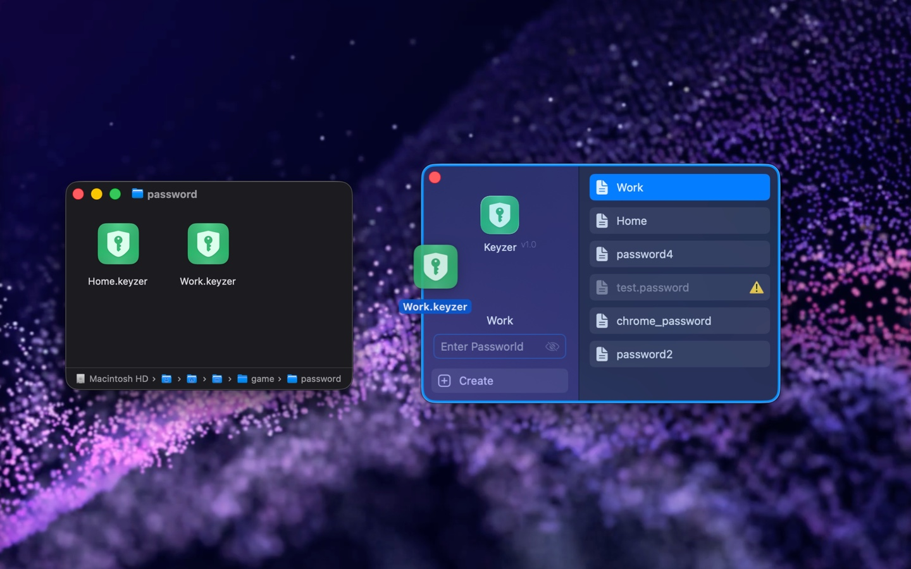

<!--idoc:ignore:start-->
> [!TIP]
> 声明：此项目并非开源项目，仓库作为官方网站，用于收集问题和用户需求。这样做是为了节省成本，因为没有官网，应用无法通过审核。
<!--idoc:ignore:end-->

   
   
  
  <h1>
    Keyzer 密码管理器
  </h1>
  <!--rehype:style=border: 0;-->
  

    <a href="./README.md">English</a> • 
    <a target="_blank" href="https://github.com/jaywcjlove/keyzer/issues/new?template=bug_report_cn.yml">联系&支持</a> • 
    <a href="./CHANGELOG.zh.md">更新日志</a>
  

  

    
  

Keyzer 是一款原生应用，用于安全存储你的所有密码及其他私密信息。
在日常生活中，我们都有不希望他人知晓的内容，如信用卡信息、银行账户资料和各类密码。
Keyzer 会将这些数据加密保存为一个可携带的 Keyzer 文件，让你在确保安全的同时，依然能轻松使用。

<!--idoc:config:
title: Keyzer
keywords: Keyzer,密码管理器,密码,安全,加密,隐私,安全存储,密码保险库,本地存储,离线,数据保护,简单,易用
description: 一款原生应用，用于安全存储你的所有密码及其他私密信息
-->